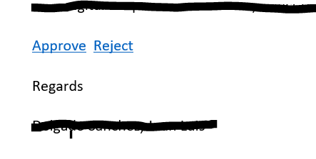
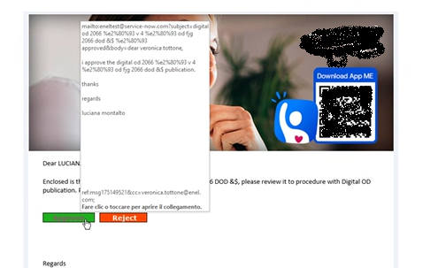

# Approval Buttons on ServiceNow Email
We mostly know how to create an Approve / Reject button on the approval email but sometimes those buttons doesn't show up on our office emails, it gets converted into a link with the text like this following image.


The trick to make the buttons work or look as buttons is to use pure CSS. Instead of creating HTML buttons we can covert an anchor tag to a box with CSS which looks something like this.


HTML & CSS Code of mailto Approve button <a href="mailto: instance@service-now.com?subject=Approve&body=xxx&cc=xxx@service-now.com" style="background: #1faf1f; border: 1px solid #000000; font-family: tahoma; font-weight: 900; letter-spacing: 1px; font-size: 14px; mso-height-rule: exactly; padding-block: 7px; text-align: center; text-decoration: none; border-radius: 3px; font-weight: 900;cursor:pointer;"> &nbsp;&nbsp;&nbsp;&nbsp;<span style="color:#ffffff">Approve</span>&nbsp;&nbsp;&nbsp;&nbsp;</a>
```
<a href="mailto: instance@service-now.com?subject=Approve&body=xxx&cc=xxx@service-now.com" style="background: #1faf1f; border: 1px solid #000000; font-family: tahoma; font-weight: 900; letter-spacing: 1px; font-size: 14px; mso-height-rule: exactly; padding-block: 7px; text-align: center; text-decoration: none; border-radius: 3px; font-weight: 900;cursor:pointer;"> &nbsp;&nbsp;&nbsp;&nbsp;<span style="color:#ffffff">Approve</span>&nbsp;&nbsp;&nbsp;&nbsp;</a>
```
HTML & CSS Code of mailto Reject button <a href="mailto: instaceName@service-now.com?subject=Reject&body=xxx&cc=xxx@service-now.com" style="background: #ff4500; border: 1px solid #000000; font-family: tahoma; font-weight: 900; letter-spacing: 1px; font-size: 14px; mso-height-rule: exactly; padding-block: 7px; text-align: center; text-decoration: none; border-radius: 3px; font-weight: 900;cursor:pointer;"> &nbsp;&nbsp;&nbsp;&nbsp;<span style="color:#ffffff">Reject</span>&nbsp;&nbsp;&nbsp;&nbsp;</a>
```
<a href="mailto: instaceName@service-now.com?subject=Reject&body=xxx&cc=xxx@service-now.com" style="background: #ff4500; border: 1px solid #000000; font-family: tahoma; font-weight: 900; letter-spacing: 1px; font-size: 14px; mso-height-rule: exactly; padding-block: 7px; text-align: center; text-decoration: none; border-radius: 3px; font-weight: 900;cursor:pointer;"> &nbsp;&nbsp;&nbsp;&nbsp;<span style="color:#ffffff">Reject</span>&nbsp;&nbsp;&nbsp;&nbsp;</a>
```
