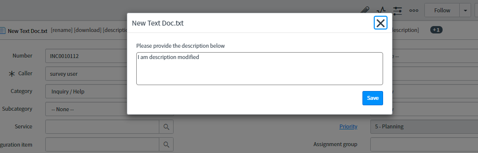

# Provide description of Attachment while uploading a file
There are two parts of how Attachment UI works in ServiceNow.

- attachment_entry [Macro](attachmentMacro.xml) 
- attachment [UI Page](attachment%20UI%20Page.html)

When we add a new attachment clicking 'Choose File', the UI page Client Script render the attachment info within the Attachment Modal window.

But if you refreshed the page, the already attached files are getting rendered by the Macro.

So in order to bring a new input for an attachment you have to edit the code in both place so that it can sync over.

On click of Save the description will be updated in sys_attachment table's description field
#### Description Modal


#### Attachment Modal


The code for bringing description of an attachment from server and rendering the description modal is here
```javascript
function updateDescription(attch_id, file_name) {
  var ga = new GlideAjax('attachmentDescription');
  ga.addParam('sysparm_name','getDescription');
  ga.addParam('sysparm_id', attch_id);
  ga.getXMLAnswer(callback, null, attch_id);
  function callback(answer, attch_id){
    var gm = new GlideModal('attachment_description', false, 500);
    gm.setTitle(file_name);
    gm.setPreference('target_desc', answer);
    gm.render();
    sendDesc=function (val){
      var ga = new GlideAjax('attachmentDescription');
      ga.addParam('sysparm_name','setDescription');
      ga.addParam('sysparm_id', attch_id);
      ga.addParam('sysparm_desc', val);
      ga.getXMLAnswer(function(answer){
          alert(answer);
      });
      gm.destroy();
    }
  }
}
```